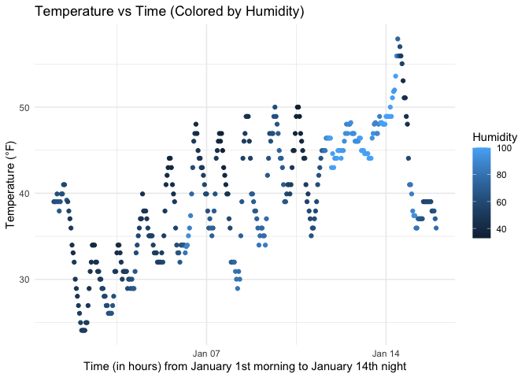

p8105_hw1_kiu2103
================
Kaveri Uberoy
2025-09-18

Loading information and libraries for problems 1 and 2.

``` r
library(moderndive)
library(tidyverse)
```

    ## ── Attaching core tidyverse packages ──────────────────────── tidyverse 2.0.0 ──
    ## ✔ dplyr     1.1.4     ✔ readr     2.1.5
    ## ✔ forcats   1.0.0     ✔ stringr   1.5.1
    ## ✔ ggplot2   3.5.2     ✔ tibble    3.3.0
    ## ✔ lubridate 1.9.4     ✔ tidyr     1.3.1
    ## ✔ purrr     1.1.0     
    ## ── Conflicts ────────────────────────────────────────── tidyverse_conflicts() ──
    ## ✖ dplyr::filter() masks stats::filter()
    ## ✖ dplyr::lag()    masks stats::lag()
    ## ℹ Use the conflicted package (<http://conflicted.r-lib.org/>) to force all conflicts to become errors

``` r
data("early_january_weather")
```

The variables in the `early_january_weather` dataset are: origin, year,
month, day, hour, temp, dewp, humid, wind_dir, wind_speed, wind_gust,
precip, pressure, visib, time_hour.

The size of the `early_january_weather` dataset is 358 rows and 15
columns.

The mean temperature for the early January weather dataset is
39.5821229.

``` r
library(ggplot2)

ggplot(early_january_weather, aes(x = time_hour, y = temp, color = humid)) +
  geom_point() +
  labs(title = "Temperature vs Time (Colored by Humidity)",
       x = "Time (in hours) from January 1st morning to January 14th night",
       y = "Temperature (°F)",
       color = "Humidity") +
  theme_minimal()
```

<!-- -->

``` r
ggsave("scatterplot_temperature_vs_time.png", width = 8, height = 6)
```

Problem 2. Making a dataframe.

``` r
new_df = 
  tibble(
    random_samp = rnorm(10),
    logical_vector = rnorm(10) > 0,
    char_vector  = letters[1:10],
    factor_vector = factor(sample(c("low", "medium", "high"), 10, replace = TRUE), ordered=TRUE)
  )
```

Now, try to take the mean of each.

``` r
mean(pull(new_df, random_samp)) # Works, because it's numeric
```

    ## [1] -0.6818454

``` r
mean(pull(new_df, logical_vector))# Works, logical values become either 0 or 1
```

    ## [1] 0.5

``` r
mean(pull(new_df, char_vector)) # Will give an error, because characters don't automatically get converted to numeric
```

    ## Warning in mean.default(pull(new_df, char_vector)): argument is not numeric or
    ## logical: returning NA

    ## [1] NA

``` r
mean(pull(new_df, factor_vector)) # Will give an error, because factors don't automatically get converted to numeric
```

    ## Warning in mean.default(pull(new_df, factor_vector)): argument is not numeric
    ## or logical: returning NA

    ## [1] NA

Try again after trying to convert to numeric

``` r
# Logical to Numeric (0 = FALSE, 1 = TRUE)
mean(as.numeric(pull(new_df, logical_vector)))
```

    ## [1] 0.5

``` r
# Character with as.numeric() returns NA for each element, does not work
mean(as.numeric(pull(new_df, char_vector)))  
```

    ## Warning in mean(as.numeric(pull(new_df, char_vector))): NAs introduced by
    ## coercion

    ## [1] NA

``` r
# Factor with as.numeric() returns the corresponding value for each factor
mean(as.numeric(pull(new_df, factor_vector)))
```

    ## [1] 1.9
